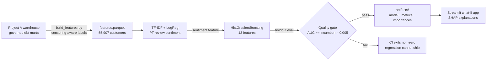

# 🤖 Customer Churn Insights — Repeat-Purchase Propensity

**Live app:** [shivanshu-analytics.streamlit.app/Churn_Predictor](https://shivanshu-analytics.streamlit.app/Churn_Predictor) · **Feature source:** [ecom-analytics-platform](https://github.com/Shivay815/ecom-analytics-platform) · **Portfolio:** [shivanshu-analytics.vercel.app](https://shivanshu-analytics.vercel.app)


Interactive ML on real marketplace data: which first-time buyers will purchase
again within 180 days? Features come from Project A's governed dbt marts
(train/serve parity by construction), retraining runs weekly behind a CI
quality gate that refuses to ship a regressed model.

## 1. Business Problem

Churn on a marketplace with a ~3% repeat rate isn't "who will leave" (almost
everyone does) — it's **"which rare repeaters can retention spend actually
reach?"** Ranking first-time buyers by repeat propensity turns a blanket
win-back campaign into a targeted one.

## 2. Honest Model Card (measured on 11,182-customer holdout)

| Metric | Value | Reading |
|---|---|---|
| ROC-AUC | **0.587** | Modest signal — first-order attributes genuinely carry limited information about repeat behavior on Olist. Reported as measured. |
| Lift @ top decile | **1.69×** | Targeting the top-scored 10% reaches 1.69× the repeaters random targeting would. |
| Recall @ top decile | **16.9%** | of all future repeaters appear in the top decile. |
| Brier score | **0.027** | Well-calibrated probabilities (a deliberate trade-off — see below). |
| Base rate | 2.80% | 1,566 repeaters of 55,907 first-time buyers. |
| Train time | 1.3s | Full retrain is cheap; weekly cadence costs nothing. |

**What I'd tell a stakeholder:** this model makes a top-decile campaign ~70%
more efficient than spray-and-pray. It will not "identify churners with 85%
accuracy" — nothing trained on these features will, and a model card that
claimed so should worry you.

## 3. System Architecture



## 4. Engineering Decisions & Trade-offs

| Decision | Alternative | Why this |
|---|---|---|
| Censoring-aware label (exclude customers with <180 observable days) | Label everyone | Customers near the dataset edge haven't had time to repeat; labeling them 0 teaches the model that recent = churned. Classic leakage-adjacent bug, excluded by construction. |
| Unweighted shallow HGB | `class_weight="balanced"` | Measured: balancing wrecked calibration (Brier 0.235 vs 0.027) *and* cost AUC (0.565 vs 0.587). Ranking quality survives without weights, and the app can display honest probabilities. |
| Sentiment as a distilled feature (TF-IDF+LR sub-model → one number) | Raw TF-IDF into the main model | Keeps the main model dense/SHAP-friendly and the app's inputs human-editable; the sub-model is self-supervised from star ratings, no manual labeling. |
| Features from Project A's marts | Separate feature pipeline | Train/serve parity by construction — the dashboard and the model read the same tested tables; no drift between "analytics revenue" and "model revenue". |
| Gate on ROC-AUC with 0.005 tolerance | Ship every retrain | A weekly retrain on drifted or corrupted data fails CI instead of silently degrading the app. |

## 5. Run It Yourself

```bash
git clone https://github.com/Shivay815/churn-insights-app
cd churn-insights-app
python3 -m venv .venv && source .venv/bin/activate
make setup   # deps
make data    # builds Project A's warehouse (clones it if needed)
make features && make train && make test
```

`make train` twice demonstrates the quality gate (second run compares against
the first's metrics).

## 6. Roadmap

- Post-first-order behavioral features (session data would lift AUC meaningfully — the honest ceiling on purchase-only features is low)
- Probability calibration monitoring across weekly retrains
- Champion/challenger artifact slots instead of single incumbent

## Data & License

Code: MIT. Data: Olist public dataset (CC BY-NC-SA 4.0) via
[Project A's ingestion contract](https://github.com/Shivay815/ecom-analytics-platform).
